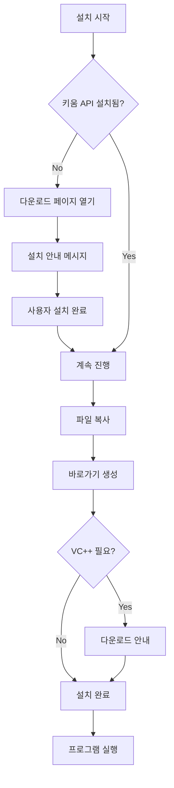

# 🎁 완전 자동화 설치 프로그램 제작 가이드

## 📋 준비물

### 1. Inno Setup 설치

- [Inno Setup 다운로드](https://jrsoftware.org/isdl.php)
- 최신 버전 설치 (6.x 이상)
- 한국어 팩 포함

### 2. 필요한 파일들

```
project/
├── dist/
│   └── DDuckSang_AutoTrading.exe  # PyInstaller로 빌드한 exe
├── installer.iss                   # Inno Setup 스크립트
├── icon.ico                        # 아이콘 (선택사항)
├── README.md
├── INSTALL.md
└── BUILD_INSTRUCTIONS.md
```

---

## 🚀 설치 프로그램 빌드

### 방법 1: Inno Setup Compiler 사용

1. Inno Setup Compiler 실행
2. `File` → `Open` → `installer.iss` 선택
3. `Build` → `Compile` (F9)
4. 완료!

### 방법 2: 명령줄 사용

```bash
"C:\Program Files (x86)\Inno Setup 6\ISCC.exe" installer.iss
```

---

## 📦 빌드 결과

```
installer_output/
└── DDuckSang_Installer_v1.0.0.exe  # 약 10MB
```

---

## ✨ 자동화 기능

### 1. **키움 OpenAPI+ 자동 감지**

```pascal
function IsKiwoomAPIInstalled: Boolean;
begin
  // 레지스트리에서 설치 확인
  Result := RegQueryStringValue(HKEY_CLASSES_ROOT,
    'CLSID\{A1574A0D-6BFA-4BD7-9020-DED88711818D}\InprocServer32',
    '', RegValue);
end;
```

**작동 방식:**

- 설치 시작 시 자동으로 키움 API 설치 확인
- 없으면 다운로드 페이지 안내
- 있으면 바로 설치 진행

---

### 2. **자동 다운로드 안내**

설치 중에 자동으로:

1. 키움 API 미설치 감지
2. 다운로드 페이지 자동 열기
3. 설치 안내 메시지 표시
4. 사용자가 설치 완료하면 계속 진행

---

### 3. **Visual C++ Redistributable**

설치 완료 후:

- 필요 여부 확인
- 다운로드 페이지 열기 (선택)

---

### 4. **바로가기 자동 생성**

```
✅ 시작 메뉴
  ├── DDuckSang 자동매매
  ├── 설치 가이드
  └── 제거
✅ 바탕화면 (선택)
✅ 빠른 실행 (선택)
```

---

### 5. **데이터 보호**

제거 시:

- "데이터 유지하시겠습니까?" 물어봄
- 예: trading.db, settings.json 보관
- 아니오: 완전 삭제

---

## 🎯 설치 프로그램 실행 흐름



---

## 📝 installer.iss 주요 기능

### 자동 감지

```pascal
// 키움 API 설치 확인
function IsKiwoomAPIInstalled: Boolean;

// 다운로드 페이지 열기
function DownloadKiwoomAPI: Boolean;
```

### 설치 검증

```pascal
// 설치 전 최종 확인
function PrepareToInstall(var NeedsRestart: Boolean): String;
```

### 사용자 친화적 메시지

```pascal
if not IsKiwoomAPIInstalled then
begin
  MsgBox('키움 OpenAPI+가 필요합니다.' + #13#10 +
         '다운로드 페이지를 여시겠습니까?',
         mbConfirmation, MB_YESNO);
end;
```

---

## 🔧 커스터마이징

### 아이콘 변경

```ini
SetupIconFile=icon.ico
```

### 회사 정보

```ini
AppPublisher={#MyAppPublisher}
AppPublisherURL={#MyAppURL}
```

### 버전 관리

```ini
AppVersion={#MyAppVersion}
VersionInfoVersion=1.0.0
```

---

## 📤 배포

### 최종 결과물

```
DDuckSang_Installer_v1.0.0.exe (약 10MB)
```

### 사용자 경험

1. 설치 프로그램 실행
2. 키움 API 자동 체크
3. 필요하면 다운로드 안내
4. 설치 진행
5. 바로가기 생성
6. 완료!

**Python 설치 필요 없음!**
**소스코드 필요 없음!**
**한 번에 모든 설정 완료!**

---

## ⚠️ 법적 고려사항

### 키움 API 재배포

❌ 직접 포함 금지 (라이선스 위반)
✅ 다운로드 링크 안내 (OK)

현재 스크립트는 **안내만** 하므로 안전합니다.

---

## 🎯 완성!

이제 `DDuckSang_Installer_v1.0.0.exe` 하나만 배포하면:

- 자동으로 모든 체크
- 필요한 것 안내
- 완벽한 설치

**진짜 원클릭 설치!** 🚀
